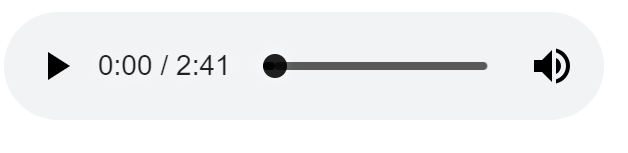
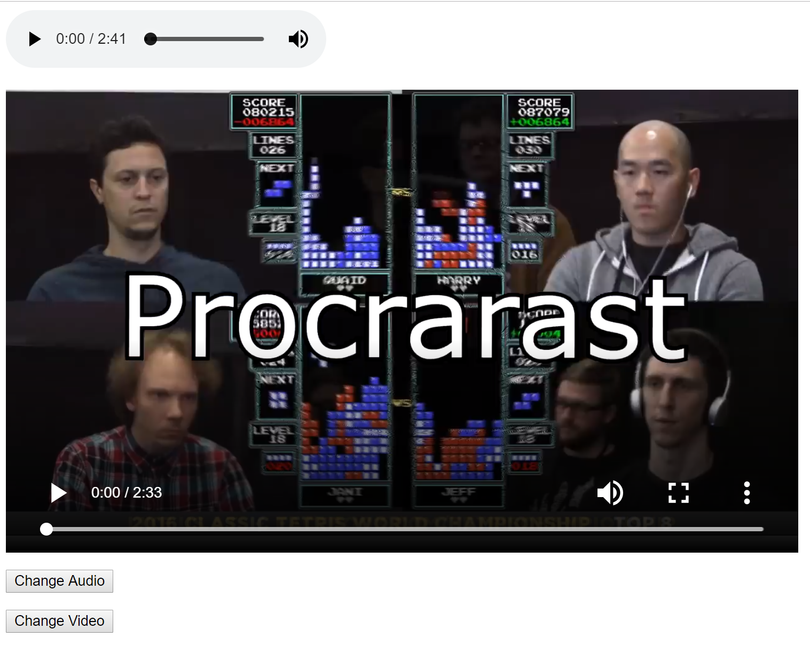

# Audio and Video

<div class="tab">
  <button class="tablinks active" onclick="openTab(event, 'Overview')">Overview</button>
<button class="tablinks" onclick="openTab(event, 'audio')">Audio</button>
  <button class="tablinks" onclick="openTab(event, 'video')">Video</button>
  <button class="tablinks" onclick="openTab(event, 'todo')">To Do</button>
  <button class="tablinks" onclick="openTab(event, 'changesource')">Change Source</button>
  <button class="tablinks" onclick="openTab(event, 'todo2')">To Do</button>
  <button class="tablinks" onclick="openTab(event, 'changejquery')">jQuery Changes</button>
<button class="tablinks" onclick="openTab(event, 'todo3')">To Do</button>
</div>
<div id="Overview" class="tabcontent" style="display:block">
<div class="tabhtml" markdown="1">

<div class="embed-responsive embed-responsive-16by9"><iframe class="embed-responsive-item" src="https://www.youtube.com/embed/pu0i31fMOpQ" frameborder="0" allowfullscreen></iframe></div>

Two of the most exciting tag elements introduced in HTML5 is the `audio` and `video` tags.  These tags allow us to embed audio and video just as easily as when we integrated images into our sites.

</div>
</div>

<div id="audio" class="tabcontent">
<div class="tabhtml" markdown="1">

For Audio, the syntax is like this:

```html
<html>
    <head>
        <title>Audio/Video</title>
    </head>
    <body>
        <audio id="song" src="https://montana-media-arts.github.io/441-WebTech-Spring2021-Examples/Week%2010/Brahms.mp3" controls="controls">
        </audio>
        <br>
    </body>
</html>
```

As you can see, the audio tag sets the src of the song and then plays the melody.  There is an attribute called **controls**, which allows the necessary controls to appear for the music player.

</div>
</div>

<div id="video" class="tabcontent">
<div class="tabhtml" markdown="1">

Similarly, the video controls work the same way.  The syntax looks like this:

```html
<html>
    <head>
        <title>Audio/Video</title>
    </head>
    <body>

        <video id="film" src="https://montana-media-arts.github.io/441-WebTech-Spring2021-Examples/Week%2010/BOOM.mp4" type="video/mp4" controls="true">
        </video>
    </body>
</html>
```

</div>
</div>

<div id="todo" class="tabcontent">
<div class="tabhtml" markdown="1">

### Try it yourself!

1. Can you add your audio? 
2. Can you add your video? Find a great meme and make it appear!

**Hint** Remember you need a fully qualified URL here for an example: **https://montana-media-arts.github.io/441-WebTech-Spring2021-Examples/Week%2010/Brahms.mp3**

#### Screenshot



<p class="codepen" data-height="265" data-theme-id="light" data-default-tab="html,result" data-user="retrog4m3r" data-slug-hash="BaQvbBx" style="height: 265px; box-sizing: border-box; display: flex; align-items: center; justify-content: center; border: 2px solid; margin: 1em 0; padding: 1em;" data-pen-title="MART 441 Audio Example">
  <span>See the Pen <a href="https://codepen.io/retrog4m3r/pen/BaQvbBx">
  MART 441 Audio Example</a> by Michael Cassens (<a href="https://codepen.io/retrog4m3r">@retrog4m3r</a>)
  on <a href="https://codepen.io">CodePen</a>.</span>
</p>
<script async src="https://cpwebassets.codepen.io/assets/embed/ei.js"></script>


<p class="codepen" data-height="265" data-theme-id="light" data-default-tab="html,result" data-user="retrog4m3r" data-slug-hash="wvoROBx" style="height: 265px; box-sizing: border-box; display: flex; align-items: center; justify-content: center; border: 2px solid; margin: 1em 0; padding: 1em;" data-pen-title="MART 441 Video Example">
  <span>See the Pen <a href="https://codepen.io/retrog4m3r/pen/wvoROBx">
  MART 441 Video Example</a> by Michael Cassens (<a href="https://codepen.io/retrog4m3r">@retrog4m3r</a>)
  on <a href="https://codepen.io">CodePen</a>.</span>
</p>
<script async src="https://cpwebassets.codepen.io/assets/embed/ei.js"></script>

Did it work? Yes? Well done!

</div>
</div>

<div id="changesource" class="tabcontent">
<div class="tabhtml" markdown="1">

## Change Source with Events

For audio, it looks like this:

```javascript
    var audio = document.getElementById("song");
    audio.src="https://montana-media-arts.github.io/441-WebTech-Spring2021-Examples/Week%2010/Brahms.mp3";
```

and for the video, it would like like this:

```javascript
    var film = document.getElementById("film");
    film.src="https://montana-media-arts.github.io/441-WebTech-Spring2021-Examples/Week%2010/Cat.mp4";
```

So, if we put it all together now.  The HTML file would look like this:

```html
<html>
    <head>
        <title>Audio/Video</title>
        <script src="main.js"></script>
    </head>
    <body>

        <audio id="song" src="https://montana-media-arts.github.io/441-WebTech-Spring2021-Examples/Week%2010/Brahms.mp3" controls="controls">
        </audio>
        <br>
        <video id="film" src="https://montana-media-arts.github.io/441-WebTech-Spring2021-Examples/Week%2010/BOOM.mp4" type="video/mp4" controls="true">
        </video>

        <p></p>
        <button onclick="updateAudio();">Change Audio</button>

        <p></p>
        <button onclick="updateVideo();">Change Video</button>

    </body>
</html>
```

While the JavaScript file would look like this:

```javascript
function updateAudio()
{
    var audio = document.getElementById("song");
    audio.src="https://montana-media-arts.github.io/441-WebTech-Spring2021-Examples/Week%2010/Schubert.mp3";
}

function updateVideo()
{
    var film = document.getElementById("film");
    film.src="https://montana-media-arts.github.io/441-WebTech-Spring2021-Examples/Week%2010/Cat.mp4";
}
```

</div>
</div>

<div id="todo2" class="tabcontent">
<div class="tabhtml" markdown="1">

### Try it yourself!

1. Can you change your audio with JavaScript?
2. Can you change your video with JavaScript?

#### Screenshot




<p class="codepen" data-height="265" data-theme-id="light" data-default-tab="html,result" data-user="retrog4m3r" data-slug-hash="gOLZEav" style="height: 265px; box-sizing: border-box; display: flex; align-items: center; justify-content: center; border: 2px solid; margin: 1em 0; padding: 1em;" data-pen-title="MART 441 Change Audio/Video">
  <span>See the Pen <a href="https://codepen.io/retrog4m3r/pen/gOLZEav">
  MART 441 Change Audio/Video</a> by Michael Cassens (<a href="https://codepen.io/retrog4m3r">@retrog4m3r</a>)
  on <a href="https://codepen.io">CodePen</a>.</span>
</p>
<script async src="https://cpwebassets.codepen.io/assets/embed/ei.js"></script>

Did you get it? Yes? Great work! Keep it up!

</div>
</div>

<div id="changejquery" class="tabcontent">
<div class="tabhtml" markdown="1">

## Changes with jQuery

We can do the same thing in jQuery like this:

```javascript
$(document).ready(function(){
    $("#audiochange").click(function(){
        updateAudio();
    });

    $("#videochange").click(function(){
        updateVideo();
    });
});


function updateAudio()
{
    $("#song").attr("src", "https://montana-media-arts.github.io/441-WebTech-Spring2021-Examples/Week%2010/Schubert.mp3"); 
}

function updateVideo()
{
    $("#film").attr("src", "https://montana-media-arts.github.io/441-WebTech-Spring2021-Examples/Week%2010/Cat.mp4");
}

```

and the HTML file would look something like this:

```html
<html>
    <head>
        <title>Audio/Video</title>
        <script src="libs/jquery.min.js"></script>
        <script src="scripts/main.js"></script>
    </head>
    <body>

        <audio id="song" src="https://montana-media-arts.github.io/441-WebTech-Spring2021-Examples/Week%2010/Brahms.mp3" controls="controls">
        </audio>
        <br>
        <video id="film" src="https://montana-media-arts.github.io/441-WebTech-Spring2021-Examples/Week%2010/BOOM.mp4" type="video/mp4" controls="true">
        </video>

        <p></p>
        <button id="audiochange">Change Audio</button>

        <p></p>
        <button id="videochange">Change Video</button>

    </body>
</html>
```

</div>
</div>

<div id="todo3" class="tabcontent">
<div class="tabhtml" markdown="1">

### Try it yourself!

1. Can you change your audio with jQuery?
2. Can you change your video with jQuery?

#### Screenshot


<p class="codepen" data-height="265" data-theme-id="light" data-default-tab="html,result" data-user="retrog4m3r" data-slug-hash="JjbwzXR" style="height: 265px; box-sizing: border-box; display: flex; align-items: center; justify-content: center; border: 2px solid; margin: 1em 0; padding: 1em;" data-pen-title="MART 441 jQuery Change Audio/Video">
  <span>See the Pen <a href="https://codepen.io/retrog4m3r/pen/JjbwzXR">
  MART 441 jQuery Change Audio/Video</a> by Michael Cassens (<a href="https://codepen.io/retrog4m3r">@retrog4m3r</a>)
  on <a href="https://codepen.io">CodePen</a>.</span>
</p>
<script async src="https://cpwebassets.codepen.io/assets/embed/ei.js"></script>

Did you get it again? Yes? Good job! I knew you could do it!

So, what about the canvas?

</div>
</div>

