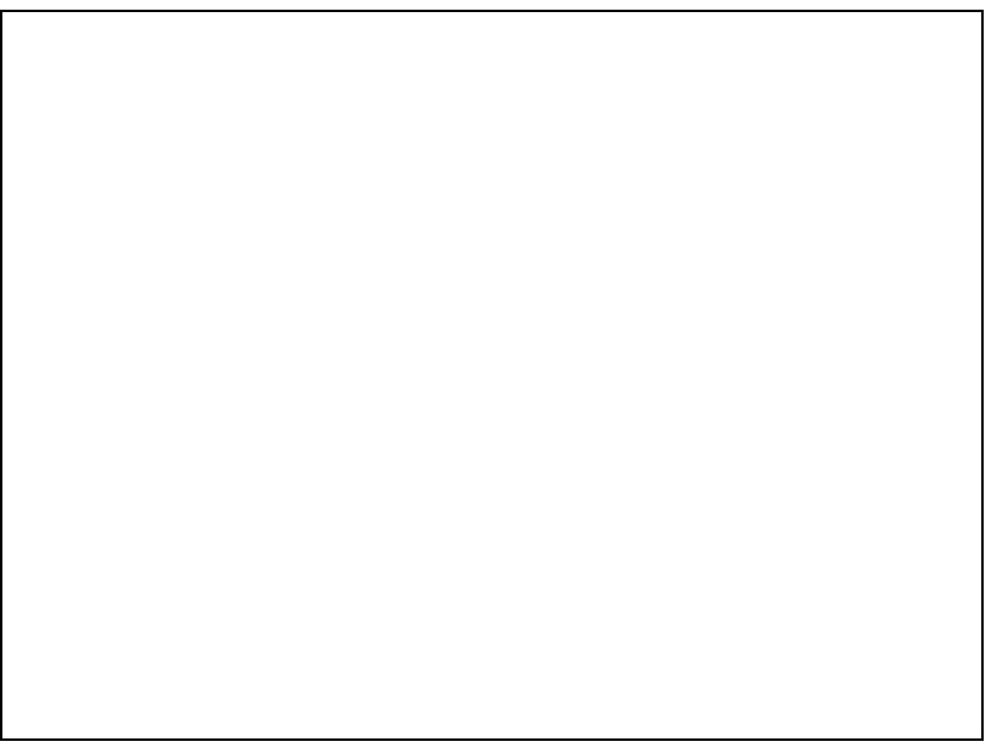

# HTML5 Canvas

<div class="tab">
  <button class="tablinks active" onclick="openTab(event, 'Overview')">Overview</button>
<button class="tablinks" onclick="openTab(event, 'basicsetup')">Basic Setup</button>
  <button class="tablinks" onclick="openTab(event, 'todo')">To Do</button>
  <button class="tablinks" onclick="openTab(event, 'draw')">Draw</button>
  <button class="tablinks" onclick="openTab(event, 'todo2')">To Do</button>
  
</div>
<div id="Overview" class="tabcontent" style="display:block">
<div class="tabhtml" markdown="1">

<div class="embed-responsive embed-responsive-16by9"><iframe class="embed-responsive-item" src="https://www.youtube.com/embed/ZwYFdU3lHSo" frameborder="0" allowfullscreen></iframe></div>

The HTML5 Canvas is a revolutionary tag element that provides many benefits, such as:

* HTML Canvas Can be Animated
  * Canvas objects can move. Everything is possible: from simple bouncing balls to complex animations.

* HTML Canvas Can Be Interactive
  * Canvas can respond to JavaScript events.
  * Canvas can respond to any user action (key clicks, mouse clicks, button clicks, finger movement)

* HTML Canvas Used for Games
  * Canvas' methods for animations offer a lot of possibilities for HTML gaming applications.

</div>
</div>

<div id="basicsetup" class="tabcontent">
<div class="tabhtml" markdown="1">

Let's take a look at the most basic set up of the canvas.  If you want the canvas to appear, you need the canvas tag.  It looks like this:

```html
<html>
    <head>
        <title>Canvas</title>
    </head>
   
    <body>
        <canvas id="myCanvas" height="600" width="800"></canvas>

    </body>
</html>
```

#### Screenshot



</div>
</div>

<div id="todo" class="tabcontent">
<div class="tabhtml" markdown="1">

### Try it yourself!

How can you make a border around the canvas?  Use the code above to make a border so you can see the canvas outline.

<p class="codepen" data-height="265" data-theme-id="light" data-default-tab="html,result" data-user="retrog4m3r" data-slug-hash="YzpdgGr" style="height: 265px; box-sizing: border-box; display: flex; align-items: center; justify-content: center; border: 2px solid; margin: 1em 0; padding: 1em;" data-pen-title="MART 441 Basic Canvas">
  <span>See the Pen <a href="https://codepen.io/retrog4m3r/pen/YzpdgGr">
  MART 441 Basic Canvas</a> by Michael Cassens (<a href="https://codepen.io/retrog4m3r">@retrog4m3r</a>)
  on <a href="https://codepen.io">CodePen</a>.</span>
</p>
<script async src="https://cpwebassets.codepen.io/assets/embed/ei.js"></script>

Did it work? Yes? Good job!

</div>
</div>

<div id="draw" class="tabcontent">
<div class="tabhtml" markdown="1">

## How do we draw?

For us to interact with the canvas, we have to get the context of the canvas in 2d (3d requires a library and WebGL to help us).

```javascript
    var canvas = document.getElementById("myCanvas");
    var ctx = canvas.getContext("2d");   
```

Now, we can draw something by adding these two lines.  You should see a single blue square on your canvas.

```javascript
    ctx.fillStyle = "#0000FF";
    ctx.fillRect(50, 50, 10, 10);
```

</div>
</div>

<div id="todo2" class="tabcontent">
<div class="tabhtml" markdown="1">

### You give it a try!

<p class="codepen" data-height="265" data-theme-id="light" data-default-tab="html,result" data-user="retrog4m3r" data-slug-hash="qBqLvqR" style="height: 265px; box-sizing: border-box; display: flex; align-items: center; justify-content: center; border: 2px solid; margin: 1em 0; padding: 1em;" data-pen-title="MART 441 Canvas Item">
  <span>See the Pen <a href="https://codepen.io/retrog4m3r/pen/qBqLvqR">
  MART 441 Canvas Item</a> by Michael Cassens (<a href="https://codepen.io/retrog4m3r">@retrog4m3r</a>)
  on <a href="https://codepen.io">CodePen</a>.</span>
</p>
<script async src="https://cpwebassets.codepen.io/assets/embed/ei.js"></script>

Did you get a little blue square? Yes? Great!

So, what else can we do?

</div>
</div>
