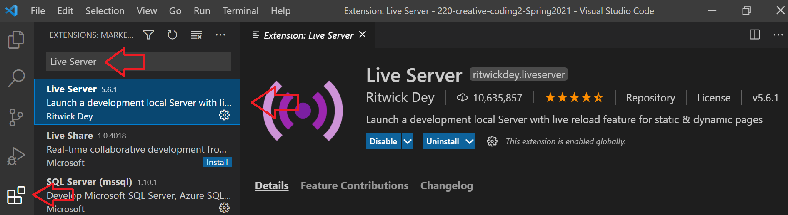

# threejs Install

First, go to <a href="https://threejs.org/" target="_new">threejs.org</a> and download the library or <a href="https://github.com/mrdoob/three.js/archive/master.zip" target="_new">Download here</a>  From there, know that you need a live server to make this work. You can get this as an add-on in Atom and Visual Studio Code or Atom.  It won't run correctly otherwise.

## Live Server Instructions

Don't forget to create a js or library folder to hold your threejs file.  You can find the file you need in the **build** folder after you unzip the file.