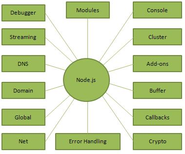

# Node.js

**What is Node.js?**

* Node.js is a server-side platform built on Google Chrome's JavaScript Engine (V8 Engine). Node.js was developed by Ryan Dahl in 2009 and its latest version is v0.10.36. The definition of Node.js as supplied by its official documentation is as follows −

* Node.js is a platform built on Chrome's JavaScript runtime for easily building fast and scalable network applications. Node.js uses an event-driven, non-blocking I/O model that makes it lightweight and efficient, perfect for data-intensive real-time applications that run across distributed devices.

* Node.js is an open source, cross-platform runtime environment for developing server-side and networking applications. Node.js applications are written in JavaScript, and can be run within the Node.js runtime on OS X, Microsoft Windows, and Linux.

* Node.js also provides a rich library of various JavaScript modules which simplifies the development of web applications using Node.js to a great extent.

### Node.js = Runtime Environment + JavaScript Library

#### Features of Node.js

Following are some of the important features that make Node.js the first choice of software architects.

**Asynchronous and Event Driven** − All APIs of Node.js library are asynchronous, that is, non-blocking. It essentially means a Node.js based server never waits for an API to return data. The server moves to the next API after calling it and a notification mechanism of Events of Node.js helps the server to get a response from the previous API call.

**Very Fast** − Being built on Google Chrome's V8 JavaScript Engine, Node.js library is very fast in code execution.

**Single Threaded but Highly Scalable** − Node.js uses a single threaded model with event looping. Event mechanism helps the server to respond in a non-blocking way and makes the server highly scalable as opposed to traditional servers which create limited threads to handle requests. Node.js uses a single threaded program and the same program can provide service to a much larger number of requests than traditional servers like Apache HTTP Server.

**No Buffering** − Node.js applications never buffer any data. These applications simply output the data in chunks.

**License** − Node.js is released under the MIT license.

#### Who Uses Node.js?

This list includes eBay, General Electric, GoDaddy, Microsoft, PayPal, Uber, Wikipins, Yahoo!, and Yammer to name a few.

#### Concepts

The following diagram depicts some important parts of Node.js.

#### Where to Use Node.js?

The following are the areas where Node.js is proving itself as a perfect technology partner.

* I/O bound Applications
* Data Streaming Applications
* Data Intensive Real-time Applications (DIRT)
* JSON APIs based Applications
* Single Page Applications

#### Where Not to Use Node.js?

* It is not advisable to use Node.js for CPU intensive applications.

