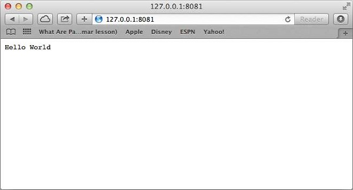

# Setup the server

Before creating an actual "Hello, World!" application using Node.js, let us see the components of a Node.js application. A Node.js application consists of the following three important components −

**Import required modules** − We use the require directive to load Node.js modules.

**Create server** − A server which will listen to client's requests similar to Apache HTTP Server.

**Read request and return response** − The server created in an earlier step will read the HTTP request made by the client which can be a browser or a console and return the response.

### Creating Node.js Application

**Step 1** - Import Required Module

We use the require directive to load the http module and store the returned HTTP instance into an http variable as follows −

```js
var http = require("http");
```

**Step 2** - Create Server

We use the created http instance and call `http.createServer()` method to create a server instance and then we bind it at port 8081 using the listen method associated with the server instance. Pass it a function with parameters request and response. Write the sample implementation to always return "Hello World".

```js
http.createServer(function (request, response) {
   // Send the HTTP header 
   // HTTP Status: 200 : OK
   // Content Type: text/plain
   response.writeHead(200, {'Content-Type': 'text/plain'});
   
   // Send the response body as "Hello World"
   response.end('Hello World\n');
}).listen(8081);

// Console will print the message
console.log('Server running at http://127.0.0.1:8081/');
```

The above code is enough to create an HTTP server which listens, i.e., waits for a request over `8081` port on the local machine.

**Step 3** - Testing Request & Response

Let's put step 1 and 2 together in a file called main.js and start our HTTP server as shown below −

```js
var http = require("http");

http.createServer(function (request, response) {
   // Send the HTTP header 
   // HTTP Status: 200 : OK
   // Content Type: text/plain
   response.writeHead(200, {'Content-Type': 'text/plain'});
   
   // Send the response body as "Hello World"
   response.end('Hello World\n');
}).listen(8081);

// Console will print the message
console.log('Server running at http://127.0.0.1:8081/');
```

Now execute the main.js to start the server as follows −

```js
node main.js
```

Verify the Output. Server has started.

```js
Server running at http://127.0.0.1:8081/
```

**Make a Request to the Node.js Server**

Open `http://127.0.0.1:8081/` in any browser and observe the following result.




Congratulations, you have your first HTTP server up and running which is responding to all the HTTP requests at port 8081.