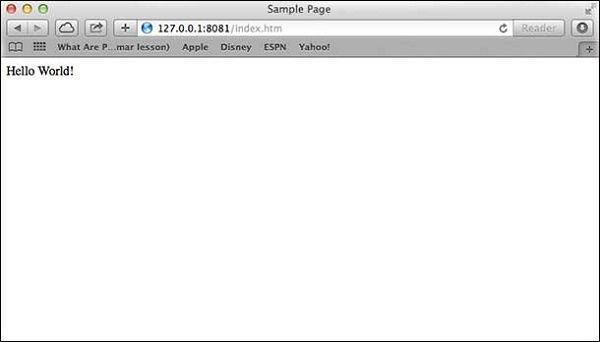

# Web Module

**What is a Web Server?**

A Web Server is a software application which handles HTTP requests sent by the HTTP client, like web browsers, and returns web pages in response to the clients. Web servers usually deliver html documents along with images, style sheets, and scripts.

Most of the web servers support server-side scripts, using scripting languages or redirecting the task to an application server which retrieves data from a database and performs complex logic and then sends a result to the HTTP client through the Web server.

Apache web server is one of the most commonly used web servers. It is an open source project.  There are others like IIS (Information Internet Services) by Microsoft. It is free, but it requires the Windows Operating System.

**Web Application Architecture**

A Web application is usually divided into four layers −


**Client** − This layer consists of web browsers, mobile browsers or applications which can make HTTP requests to the web server.

**Server** − This layer has the Web server which can intercept the requests made by the clients and pass them the response.

**Business** − This layer contains the application server which is utilized by the web server to do the required processing. This layer interacts with the data layer via the database or some external programs.

**Data** − This layer contains the databases or any other source of data.

**Creating a Web Server using Node**

Node.js provides an http module which can be used to create an HTTP client of a server. Following is the bare minimum structure of the HTTP server which listens at 8081 port.

Create a js file named `server.js` −

**File:** server.js

```js
var http = require('http');
var fs = require('fs');
var url = require('url');

// Create a server
http.createServer( function (request, response) {  
   // Parse the request containing file name
   var pathname = url.parse(request.url).pathname;
   
   // Print the name of the file for which request is made.
   console.log("Request for " + pathname + " received.");
   
   // Read the requested file content from file system
   fs.readFile(pathname.substr(1), function (err, data) {
      if (err) {
         console.log(err);
         
         // HTTP Status: 404 : NOT FOUND
         // Content Type: text/plain
         response.writeHead(404, {'Content-Type': 'text/html'});
      } else {	
         //Page found	  
         // HTTP Status: 200 : OK
         // Content Type: text/plain
         response.writeHead(200, {'Content-Type': 'text/html'});	
         
         // Write the content of the file to response body
         response.write(data.toString());		
      }
      
      // Send the response body 
      response.end();
   });   
}).listen(8081);

// Console will print the message
console.log('Server running at http://127.0.0.1:8081/');
```

Next let's create the following html file named `index.html` in the same directory where you created `server.js`.

**File:** index.html

```html

<html>
   <head>
      <title>Sample Page</title>
   </head>
   
   <body>
      Hello World!
   </body>
</html>
```

Now let us run the `server.js` to see the result −

```js
node server.js
```

Verify the Output.

```html
Server running at http://127.0.0.1:8081/
```

Make a request to Node.js server

Open `http://127.0.0.1:8081/index.html` in any browser to see the following result.



Verify the Output at server end.

```html
Server running at http://127.0.0.1:8081/
Request for /index.html received.
```

**Creating Web client using Node**

A web client can be created using http module. Let's check the following example.

Create a js file named `client.js` −

**File:** client.js

```js
var http = require('http');

// Options to be used by request 
var options = {
   host: 'localhost',
   port: '8081',
   path: '/index.html'  
};

// Callback function is used to deal with response
var callback = function(response) {
   // Continuously update stream with data
   var body = '';
   response.on('data', function(data) {
      body += data;
   });
   
   response.on('end', function() {
      // Data received completely.
      console.log(body);
   });
}
// Make a request to the server
var req = http.request(options, callback);
req.end();
```

Now run the `client.js` from a different command terminal other than server.js to see the result −

```js
node client.js
```

Verify the Output.

```html
<html>
   <head>
      <title>Sample Page</title>
   </head>
   
   <body>
      Hello World!
   </body>
</html>
```

Verify the Output at server end.

```js
Server running at http://127.0.0.1:8081/
Request for /index.html received.
```


