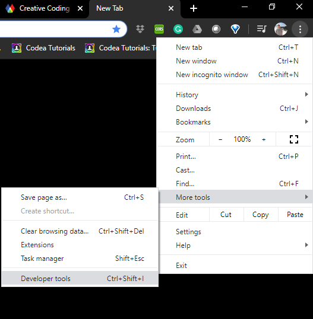
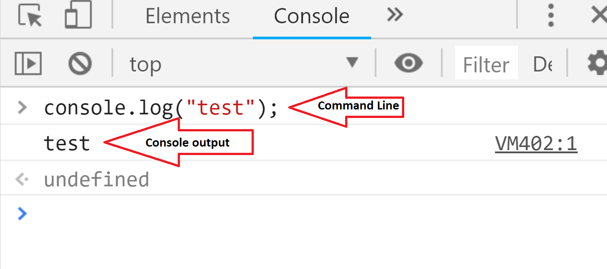
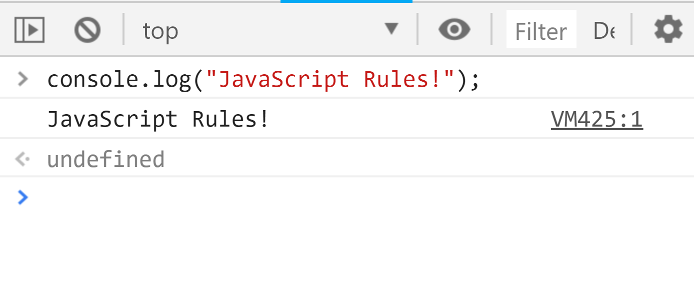

# "JavaScript Rules!" in JavaScript

<div class="tab">
  <button class="tablinks active" onclick="openTab(event, 'Overview')">Overview</button>
  <button class="tablinks" onclick="openTab(event, 'browser')">Browsers</button>
  <button class="tablinks" onclick="openTab(event, 'statements')">Statements</button>
   <button class="tablinks" onclick="openTab(event, 'execute')">Execute</button>
   <button class="tablinks" onclick="openTab(event, 'first')">First Program</button>
  <button class="tablinks" onclick="openTab(event, 'console')">Web Console</button>
</div>
<div id="Overview" class="tabcontent" style="display:block"  markdown="1">
As with any programming language, the first thing to do is write and execute some ["Hello World!" program](https://en.wikipedia.org/wiki/%22Hello,_World!%22_program).

The goal of the "Hello World!" program is to introduce you to the language, and prove that it works. The Hello World program is essentially a way to make sure you are up and running.
</div>


<div id="browser" class="tabcontent" markdown="1">
> #### Browser Recommendation
>
> Before we proceed, let's quickly add a note on tools and technologies. All examples for this course will be tested and demoed with [Google's Chrome browser](https://www.google.com/chrome/). I would suggest you download, install, and use Chrome for this course.
</div>


<div id="statements" class="tabcontent" markdown="1">
## A Series of Statements

Since JavaScript is a full-fledged programming language, it behaves differently than the markup language of HTML or the styling language of CSS. The significant difference is that JavaScript _executes_ a series of [_statements_](https://www.w3schools.com/js/js_statements.asp). Every "chunk" of code that does something unique is a _statement_. JavaScript executes these statements in order, starting at the top of a file, and working its way down.
</div>


<div id="execute" class="tabcontent" markdown="1">
## Executing Statements in the Browser

Every modern web browser built for computers (as opposed to mobile devices/OS's) includes a ["web console"](https://www.chromium.org/chromium-os/poking-around-your-chrome-os-device). This console does several things, including;

- post errors about the site
- print out information developers tell it to
- allow for interactive JavaScript statements to be executed via the ["command line"](https://developers.google.com/web/tools/chrome-devtools/console/)

<!--
<div class="embed-responsive embed-responsive-16by9"><iframe class="embed-responsive-item" src="https://www.youtube.com/embed/C6Cyrpkb25k" frameborder="0" allowfullscreen></iframe></div>
-->

For our first "Hello World!" program, we will use Chrome's "Web Console."

To open the Web Console (<kbd>Ctrl</kbd>+<kbd>Shift</kbd>+<kbd>I</kbd> on Windows and Linux or <kbd>Cmd</kbd>-<kbd>Option</kbd>-<kbd>K</kbd> on Mac), select the three vertical ellipses from the upper right hand corner of the browser. Then, select "More TOols" and then "Developer Tools" in Chrome. By default, it will open a new window to the right or bottom of the browser window. Along the bottom of the console is a command-line that you can use to enter JavaScript, and the output appears in the pane above:




</div>


<div id="first" class="tabcontent">
<div class="tabhtml" markdown="1">
## Our First Program

To write and execute our first "JavaScript Rules!" program, you should type the following into the _command line_ of the _web console_, then hit `return` on your keyboard.

```js
console.log("JavaScript Rules!");
```

After pressing `return,` you should see "JavaScript Rules!" printed to the _web console_ window.



**CONGRATULATIONS, YOU HAVE WRITTEN YOUR FIRST PROGRAM FOR THIS COURSE!!!!**

## What is Happening

In this "JavaScript Rules!" program, there are a couple of things happening. We will discuss these in greater detail in the coming weeks.

For the moment, I will tell you that you have written a statement that uses a function (`console.log()`) that _prints directly to the JS web console_.

Within that console.log function, you included a _string_ as the sole input _parameter_.

A _string_ is any set of text, comprising letters, numbers, and special characters (i.e., `&%^`). Strings are always surrounded by matching single (`'`) or double (`"`) quotation marks.

A _parameter_ is a value, which is passed to a function for the function to _do something_ with it.


<br />

In essence, the program you wrote and executed told the JavaScript engine to print the string `"JavaScript Rules!"` to the JS web console output.
</div>
</div>

<div id="console" class="tabcontent" markdown="1">
# Working with the Web Console

Many of the techniques and concepts discussed in the next few weeks will be capable of being explored through the command line of the web console. I would encourage you to use this tool as a playground for exploring JavaScript, how it works, what is possible, and trying new concepts.
</div>
