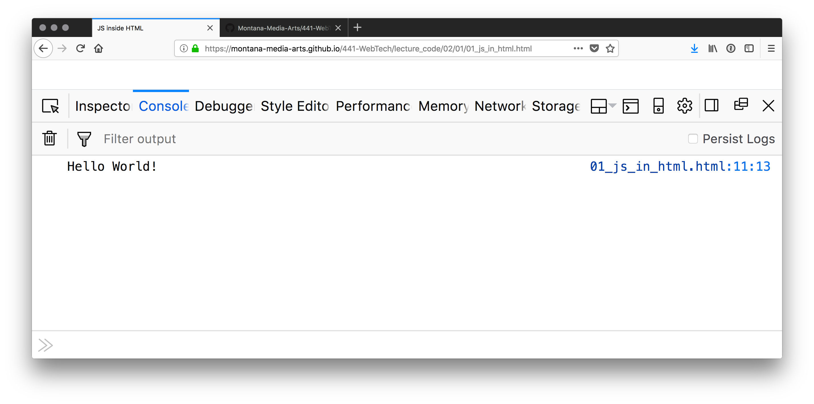

# JavaScript in HTML with the &lt;script&gt; Tag

<div class="tab">
  <button class="tablinks active" onclick="openTab(event, 'Overview')">Overview</button>
  <button class="tablinks" onclick="openTab(event, 'inline')">Inline</button>
  <button class="tablinks" onclick="openTab(event, 'external')">External</button>
   
</div>
<div id="Overview" class="tabcontent" style="display:block" >
<div class="tabhtml" markdown="1">
Since this class is about incorporating JavaScript with web development, we also need to learn how to place JS code into our HTML files. There are two primary ways of including JS code in HTML. However, they both utilize the same HTML tag, the [_script tag_](https://developer.mozilla.org/en-US/docs/Web/HTML/Element/script).

```html
<script> </script>
```
</div>
</div>

<div id="inline" class="tabcontent" >
<div class="tabhtml" markdown="1">
## Inline JavaScript

Inline JavaScript is JS code that has been written between the script tags, _within_ the HTML file itself.

As an example, let's take our first "Hello World!" program, and incorporate it into an HTML document. To do this, we will include a &lt;script&gt; element at the _end_ of our HTML file.

> NOTE: It is typically advised that developers include JavaScript tags at the end of an HTML file's &lt;body&gt; element. Putting JavaScript at the end of the file protects against slow connections. This way, a browser can load all content first, then load and execute any JavaScript code. That way, if the connection is slow, the user is not waiting on JS code before they can start viewing the webpage.

Our new file might look like the following;

<p class="codepen" data-height="600" data-theme-id="dark" data-default-tab="html,result" data-slug-hash="BawerpJ" data-editable="true" data-user="retrog4m3r" style="height: 300px; box-sizing: border-box; display: flex; align-items: center; justify-content: center; border: 2px solid; margin: 1em 0; padding: 1em;">
  <span>See the Pen <a href="https://codepen.io/retrog4m3r/pen/BawerpJ">
  console.log</a> by Michael Cassens (<a href="https://codepen.io/retrog4m3r">@retrog4m3r</a>)
  on <a href="https://codepen.io">CodePen</a>.</span>
</p>
<script async src="https://cpwebassets.codepen.io/assets/embed/ei.js"></script>

You should see "Hello World!" printed to the console output, as in the image below, and like the previous example, we wrote together. (Please note: the actual web browser window will be a blue screen with some direction.)




</div>
</div>

<div id="external" class="tabcontent">
<div class="tabhtml" markdown="1">
## External JavaScript

We can also add JavaScript as separate files, in which the main HTML document will link. This has a few advantages and disadvantages.

- **advantages:**
    - Allows for cleaner code, as we separate the JS code from the HTML content.
    - Can reduce load times if the JS files have been cached on the host computer.
- **disadvantages:**
    - When first loading a page, additional linked files can increase load times.

To load external Javascript files, we will still use the script tag. However, instead of placing code between the tags, we will use the file URL as a string to the tag's `src` attribute. (i.e. `<script src="URL-to-file.js"></script>` Notice, that we still include the closing tag.)

The above example would be created as follows if using an external JS file.

<p class="codepen" data-height="600" data-theme-id="dark" data-default-tab="js,result" data-slug-hash="WNZBzjK" data-editable="true" data-user="retrog4m3r" style="height: 300px; box-sizing: border-box; display: flex; align-items: center; justify-content: center; border: 2px solid; margin: 1em 0; padding: 1em;">
  <span>See the Pen <a href="https://codepen.io/retrog4m3r/pen/WNZBzjK">
  console.log - external</a> by Michael Cassens (<a href="https://codepen.io/retrog4m3r">@retrog4m3r</a>)
  on <a href="https://codepen.io">CodePen</a>.</span>
</p>
<script async src="https://cpwebassets.codepen.io/assets/embed/ei.js"></script>


| [**[Code Download]**](https://github.com/Montana-Media-Arts/441-WebTech/raw/master/lecture_code/02/02/02_js_outside_html.zip) | [**[View on GitHub]**](https://github.com/Montana-Media-Arts/441-WebTech/tree/master/lecture_code/02/02/) | [**[Live Example]**](https://montana-media-arts.github.io/441-WebTech/lecture_code/02/02/02_js_outside_html.html) |

<br />


As with before, you should either;

- download and open the above code using the [code download](https://github.com/Montana-Media-Arts/441-WebTech/raw/master/lecture_code/02/02/02_js_outside_html.zip) link below, in your browser, open the console, and check the output.
- or, open the code using the [Live Example](https://montana-media-arts.github.io/441-WebTech/lecture_code/02/02/02_js_outside_html.html) link, open the console, and check the output.

Regardless of which method you choose, you should see, yet again, "Hello World!" printed to the console output.
</div>
</div>

