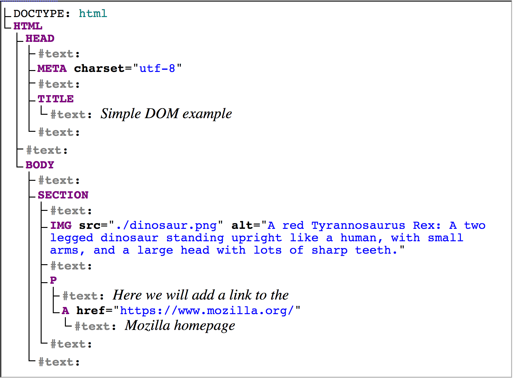

# The Document Object Model (DOM)

<h2>The following is excerpted from;</h2>

<ol>
<li><a href="https://developer.mozilla.org/en-US/docs/Learn/JavaScript/Client-side_web_APIs/Manipulating_documents"><b>Manipulating Documents.</b> MDN web docs. 2018. Web.
</a></li>
</ol>

## The important parts of a web browser

Web browsers are very complicated pieces of software with a lot of moving parts, many of which can't be controlled or manipulated by a web developer using JavaScript. You might think that such limitations are a bad thing, but browsers are locked down for good reasons, mostly centering around security. Imagine if a web site could get access to your stored passwords or other sensitive information, and log into websites as if it were you?

Despite the limitations, Web APIs still give us access to a lot of functionality that enable us to do a great many things with web pages. There are a few really obvious bits you'll reference regularly in your code — consider the following diagram, which represents the main parts of a browser directly involved in viewing web pages:

- The **window** is the browser tab that a web page is loaded into; this is represented in JavaScript by the Window object. Using methods available on this object you can do things like return the window's size (see Window.innerWidth and Window.innerHeight), manipulate the document loaded into that window, store data specific to that document on the client-side (for example using a local database or other storage mechanism), attach an event handler to the current window, and more.
- The **navigator** represents the state and identity of the browser (i.e. the user-agent) as it exists on the web. In JavaScript, this is represented by the Navigator object. You can use this object to retrieve things like geolocation information, the user's preferred language, a media stream from the user's webcam, etc.
- The **document** (represented by the DOM in browsers) is the actual page loaded into the window, and is represented in JavaScript by the Document object. You can use this object to return and manipulate information on the HTML and CSS that comprises the document, for example get a reference to an element in the DOM, change its text content, apply new styles to it, create new elements and add them to the current element as children, or even delete it altogether.

This page will focus mostly on manipulating the document specifically.

## The document object model

The document currently loaded in each one of your browser tabs is represented by a document object model. This is a "tree structure" representation created by the browser that enables the HTML structure to be easily accessed by programming languages — for example the browser itself uses it to apply styling and other information to the correct elements as it renders a page, and developers like you can manipulate the DOM with JavaScript after the page has been rendered.

Let's look at a simple example page "dom-example.html". Try opening this up in your browser — it is a very simple page containing a <section> element inside which you can find an image, and a paragraph with a link inside. The HTML source code looks like this:

| [**[ Code Download ]**](https://github.com/Montana-Media-Arts/441-WebTech/raw/master/lecture_code/06/01_dom_example/01_dom_example.zip) | [**[ View on GitHub ]**](https://github.com/Montana-Media-Arts/441-WebTech/raw/master/lecture_code/06/01_dom_example/) | [**[ Live Example ]**](https://montana-media-arts.github.io/441-WebTech/lecture_code/06/01_dom_example/dom-example.html) |

The DOM on the other hand looks like this:

> Note: This DOM tree diagram was created using [Ian Hickson's Live DOM viewer.](https://software.hixie.ch/utilities/js/live-dom-viewer/)

You can see here that each element and bit of text in the document has its own entry in the tree — each one is called a node.

## Node Terminology

You will also encounter various terms used to describe the type of node, and their position in the tree in relation to one another:

- **Element node:** An element, as it exists in the DOM.
- **Root node:** The top node in the tree, which in the case of HTML is always the HTML node (other markup vocabularies like SVG and custom XML will have different root elements).
- **Child node:** A node directly inside another node. For example, IMG is a child of SECTION in the above example.
- **Descendant node:** A node anywhere inside another node. For example, IMG is a child of SECTION in the above example, and it is also a descendant. IMG is not a child of BODY, as it is two levels below it in the tree, but it is a descendant of BODY.
- **Parent node:** A node which has another node inside it. For example, BODY is the parent node of SECTION in the above example.
- **Sibling nodes:** Nodes that sit on the same level in the DOM tree. For example, IMG and P are siblings in the above example.
- **Text node:** A node containing a text string.

It is useful to familiarize yourself with this terminology before working with the DOM, as a number of the code terms you'll come across make use of them. You may have also come across them if you have studied CSS (e.g. descendant selector, child selector).

# Additional Reading

Please also read the following to further familiarize yourself with the DOM;

- [Rascia, Tania. "Introduction to the DOM". Digital Ocean Community Tutorials. November 6th, 2017.  Accessed from: https://www.digitalocean.com/community/tutorials/introduction-to-the-dom](https://www.digitalocean.com/community/tutorials/introduction-to-the-dom)
