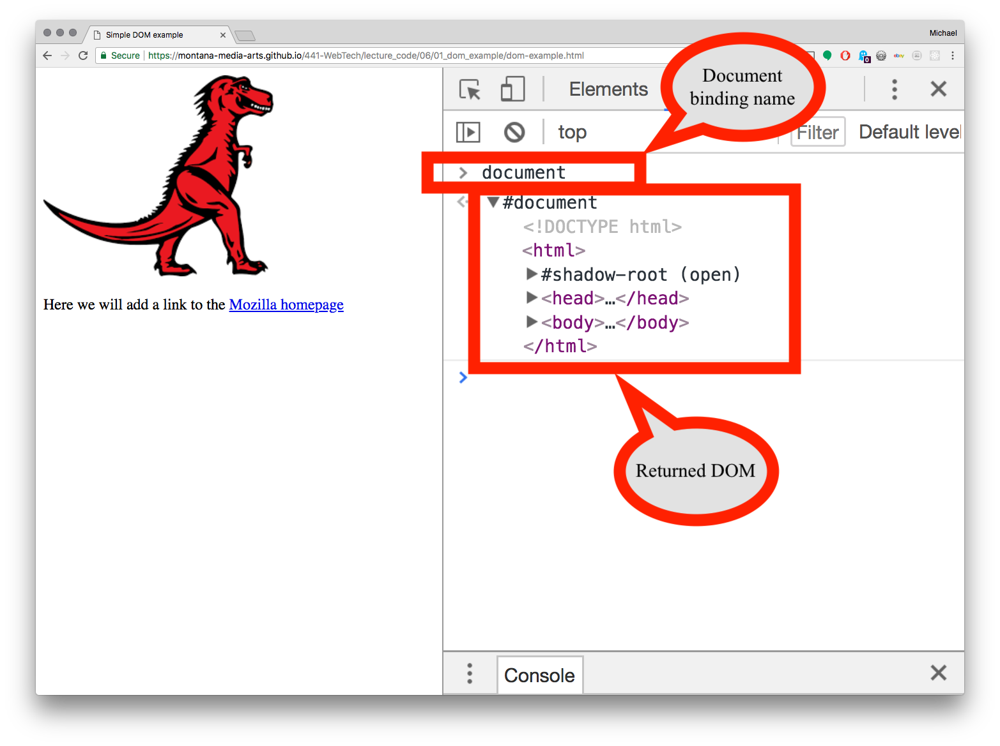
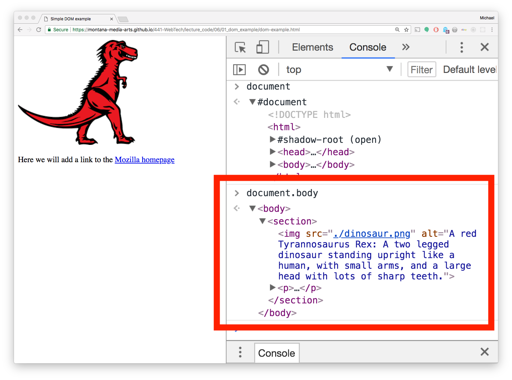
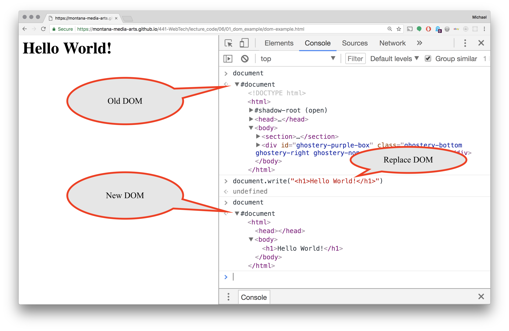
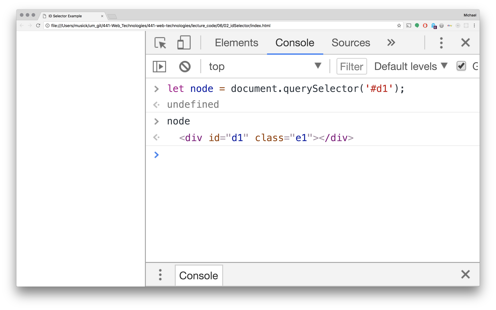

# JavaScript & The DOM

This week, we are working towards an ability for you to manipulate and alter any aspect of a web page's DOM through JavaScript.

> JavaScript allows for the complete manipulation and altering of the DOM!

## Document and Document+Body

The DOM is exposed to the JavaScript environment through `document` namespace.

The following discussion uses the same code from the previous page.

<div id="jotted-demo-1" class="jotted-theme-stacked"></div>

<script>
    new Jotted(document.querySelector("#jotted-demo-1"), {
    files: [
        {
            type: "html",
            hide: false,
            url:"https://raw.githubusercontent.com/Montana-Media-Arts/441-WebTech/master/lecture_code/06/01_dom_example/dom-example.html"
        }
    ],
    showBlank: false,
    showResult: false,
    plugins: [
        { name: 'ace', options: { "maxLines": 50 } },
        // { name: 'console', options: { autoClear: true } },
    ]
});
</script>

Notice, that when we call the `document` binding in the browser console it returns the basic DOM structure.



Likewise, when we execute `document.body`, it returns just DOM elements within the \<body\> element of the DOM.




# Altering the DOM

You may remember back to [Week 2]({{site.baseurl}}/modules/week-2/print-to-document/), when, during the "Hello World" discussions, you used `document.write()` to print "hello world!" to the web page. You may not have known this at the time, but you were altering the DOM of the web page by doing this. The `write()` method allows developers to write the entire contents of the DOM in a single function. Essentially, when you call `document.write("some html")`, you are writing the entire DOM for the webpage.

> You will probably never call that line of code again. As it wipes out everything else that you would have written!

As you can see from the following image. The original webpage is the one with the dino image we have been using. Then `document.write("<h1>Hello World!</h1>")` is executed in the Chrome console. Finally, the `document` binding is called again, and the contents of the \<body\> element has been totally replaced.



## Altering Individual ID's

It is likely you will require a more finessed approach to altering the DOM of web pages with JS. In order to do this, you will need to be able to individually select, add, remove, and alter elements of the DOM.

To begin, let's look at how we can select and alter the _inner HTML_ of individual elements through the ID attributes.

To do this, we will create a site, where the HTML includes two empty div elements, each with unique ID's. (In this case, `d1` and `d2`)

```html
<div id="d1" class="e1"></div>
<div id="d2" class="e1"></div>
```

In order to select these elements, we will query the DOM for a specific element ID. To do this, we call;

```js
let node = document.querySelector('#d1');
```


If we execute that, and then call the `node` binding, it returns the DOM element in Chrome's console.



We can use many of the same selector techniques with the `.querySelector()` method as we use in CSS to select elements. So in the current discussion, by placing a `#` in front of `d1`, we are asking the browser to find an ID tag. Likewise, if we wanted an element of a certain class type, we would prepend with a `.` (i.e. `document.querySelector('.e1')`), if we wanted an element type, we would simply provide the element name (i.e. `document.querySelector( div );`). For the current method being discussed, the browser will return the first element that successfully matches the query.


### innerText

Now that we have a reference to the DOM node, stored in a binding, we can alter the node.

One way to alter a node is to replace its "inner text". This is the actual text to display in the node. To do this, we would call the `.innerText = ` setter method on the node binding.

<div id="jotted-demo-2" class="jotted-theme-stacked"></div>

<script>
    new Jotted(document.querySelector("#jotted-demo-2"), {
    files: [
        {
            type: "js",
            hide: false,
            url:"https://raw.githubusercontent.com/Montana-Media-Arts/441-WebTech/master/lecture_code/06/02_idSelector_02/script.js"
        },
        {
            type: "html",
            hide: false,
            url:"https://raw.githubusercontent.com/Montana-Media-Arts/441-WebTech/master/lecture_code/06/02_idSelector_02/index.html"
        }
    ],
    showBlank: false,
    showResult: true,
    runScripts: false,
    plugins: [
        { name: 'ace', options: { "maxLines": 50 } },
        // { name: 'console', options: { autoClear: true } },
    ]
});
</script>

| [**[ Code Download ]**](https://github.com/Montana-Media-Arts/441-WebTech/raw/master/lecture_code/06/02_idSelector_02/02_idSelector_02.zip) | [**[ View on GitHub ]**](https://github.com/Montana-Media-Arts/441-WebTech/raw/master/lecture_code/06/02_idSelector_02/) | [**[ Live Example ]**](https://montana-media-arts.github.io/441-WebTech/lecture_code/06/02_idSelector_02/) |

This method is used to set the text, and only the text. It does not allow much else in the ways of alteration.

### innerHTML

If, instead, you want to add additional DOM elements. Or, if you want to also add attributes and other markup details, you can instead choose to utilize `innerHTML = ""`. This allows you to insert valid HTML into the selected element. As an example, we can insert multiple elements, such as headings or paragraphs, as well as include attribute details.


<div id="jotted-demo-3" class="jotted-theme-stacked"></div>

<script>
    new Jotted(document.querySelector("#jotted-demo-3"), {
    files: [
        {
            type: "js",
            hide: false,
            url:"https://raw.githubusercontent.com/Montana-Media-Arts/441-WebTech/master/lecture_code/06/02_idSelector_03/script.js"
        },
        {
            type: "html",
            hide: false,
            url:"https://raw.githubusercontent.com/Montana-Media-Arts/441-WebTech/master/lecture_code/06/02_idSelector_03/index.html"
        }
    ],
    showBlank: false,
    showResult: true,
    runScripts: false,
    plugins: [
        { name: 'ace', options: { "maxLines": 50 } },
        // { name: 'console', options: { autoClear: true } },
    ]
});
</script>

| [**[ Code Download ]**](https://github.com/Montana-Media-Arts/441-WebTech/raw/master/lecture_code/06/02_idSelector_03/02_idSelector_03.zip) | [**[ View on GitHub ]**](https://github.com/Montana-Media-Arts/441-WebTech/raw/master/lecture_code/06/02_idSelector_03/) | [**[ Live Example ]**](https://montana-media-arts.github.io/441-WebTech/lecture_code/06/02_idSelector_03/) |
