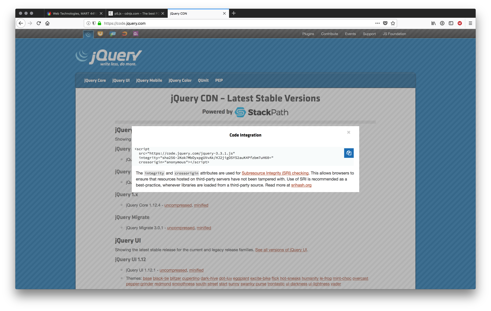

# jQuery, Your First (or Second) JS Library

<div class="tab">
  <button class="tablinks active" onclick="openTab(event, 'Overview')">Overview</button>
<button class="tablinks" onclick="openTab(event, 'started')">Get Started</button>
  <button class="tablinks" onclick="openTab(event, 'basic')">Basic HTML</button>
  <button class="tablinks" onclick="openTab(event, 'updated')">Updated HTML</button>
  <button class="tablinks" onclick="openTab(event, 'using')">Using jQuery</button>
</div>
<div id="Overview" class="tabcontent" style="display:block">
<div class="tabhtml" markdown="1">

Now that we have spent a little but of time talking about what JS libraries are and how to use them, let's look at a specific example, so you can start to figure out how to utilize them.

As stated before, one of the most popular libraries in use with JavaScript is <a href="http://jquery.com" target="_new">jQuery</a>. The folks at jQuery describe their library as "a fast, small, and feature-rich JavaScript library. It makes things like HTML document traversal and manipulation, event handling, animation, and Ajax much simpler with an easy-to-use API that works across a multitude of browsers." Essentially, jQuery is intended to make it easy for developers to select an element in the DOM, then add to it, change it, or delete it.

The goal of jQuery is to make the work you performed over the last two content cycles easier. This promise, and true effectiveness, are one of the reasons that jQuery is one of the most popular JS libraries in use today and is <a href="https://medium.com/javascript-scene/top-javascript-frameworks-and-topics-to-learn-in-2020-and-the-new-decade-ced6e9d812f9" target="_new">a good library to know</a>.

> This is not to say jQuery does not come with its own drawbacks. jQuery is starting to lose ground in popularity. This is not necessarily the fault of jQuery, just be aware, that you should always consider the advantages/disadvantages of using a library, as well as how to use it cleanly and eloquently.  Here is one person's take on it. <a href="https://codingreflections.com/should-i-learn-jquery/" target="_new">Should I still learn jQuery</a>

</div>
</div>

<div id="started" class="tabcontent">
<div class="tabhtml" markdown="1">

# Getting Started with jQuery

## 1. Including jQuery

To include jQuery in your project, you need to either download the file from their website and place it in to your projects directory or use the CDN link.

If you download a library file, you will most likely want to place it in a separate directory within your project directory. This should be called something like "`libs`". Then you can include it in the project with a script line in HTML. Your directory structure might look like the following;

```bash
/new-awesome-web-project
├── index.html
├── css/
│   └── style.css
├── fonts/
├── imgs/
├── js/
│   └── script.js
└── libs/
    └── jquery-3.3.1.min.js
```

</div>
</div>

<div id="basic" class="tabcontent">
<div class="tabhtml" markdown="1">

Your basic HTML file then might look like;

```html
<!DOCTYPE html>
<html>

<head>
    <meta charset="utf-8">
    <title>Test Page for jQuery</title>
    <meta name="author" content="Michael Cassens">
    <meta name="viewport" content="width=device-width, initial-scale=1.0">

    <link rel="stylesheet" href="./css/style.css">
</head>

<body>

    <!-- Put your HTML First -->
    <div class="container">

    </div>

    <!-- Then add your JS -->
    <!-- First, jquery. -->
    <script src="./libs/jquery-3.3.1.min.js"></script>
    <!-- Then, your scripts -->
    <script src="./js/script.js"></script>

</body>
</html>
```

<br/>

<div class="embed-responsive embed-responsive-16by9"><iframe class="embed-responsive-item" src="https://www.youtube.com/embed/wpcPIroR9Ic" frameborder="0" allowfullscreen></iframe></div>

Alternatively, if you are going to utilize a CDN to handle the library file you do not need to download the file. Instead, you need to find a CDN link that is valid and you trust. You should first check through the library if they have a specific CDN they are using, and what suggestions they make. For example, with jQuery, they use Stack Path CDN, which also allows them to include an integrity hash, this ensures that your users will not get attacked with code that has been swapped in place of the CDN file or tampered with.



</div>
</div>

<div id="updated" class="tabcontent">
<div class="tabhtml" markdown="1">

Your updated `index.html` file would like;

```html
<!DOCTYPE html>
<html>

<head>
    <meta charset="utf-8">
    <title>Test Page for jQuery</title>
    <meta name="viewport" content="width=device-width, initial-scale=1.0">

    <link rel="stylesheet" href="./css/style.css">
</head>

<body>

    <!-- Put your HTML First -->
    <div class="container">

    </div>

    <!-- Then add your JS -->
    <!-- First, jquery. -->
    <script
        src="https://code.jquery.com/jquery-3.3.1.js"
        integrity="sha256-2Kok7MbOyxpgUVvAk/HJ2jigOSYS2auK4Pfzbm7uH60="
        crossorigin="anonymous"></script>
    <!-- Then, your scripts -->
    <script src="./js/script.js"></script>

</body>
</html>
```
<br/>

<div class="embed-responsive embed-responsive-16by9"><iframe class="embed-responsive-item" src="https://www.youtube.com/embed/TJQVgk69pfA" frameborder="0" allowfullscreen></iframe></div>

</div>
</div>

<div id="using" class="tabcontent">
<div class="tabhtml" markdown="1">

## 2. Using jQuery

Now that you have a new web site that is prepped to used jQuery, you need to learn how to use it. jQuery includes resources for learning the library, including;

1. A jQuery <a href="http://learn.jquery.com" target="_new">learning center</a>
2. An <a href="http://api.jquery.com" target="_new">API documentation guide</a>

Additionally, since it is such a popular library, there are many (_MANY_) resources to help with learning jQuery online. One example is the <a href="https://www.w3schools.com/jquery/default.asp" target="_new">jQuery tutorial on w3schools</a>

We will look specifically at how to get started with jQuery, on the next page.

</div>
</div>

